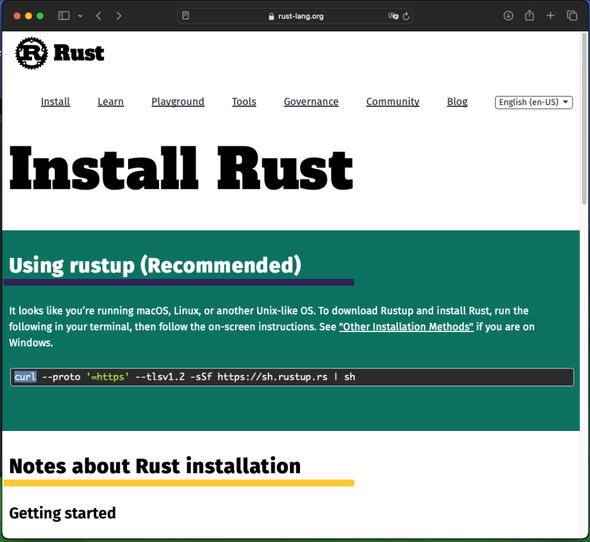
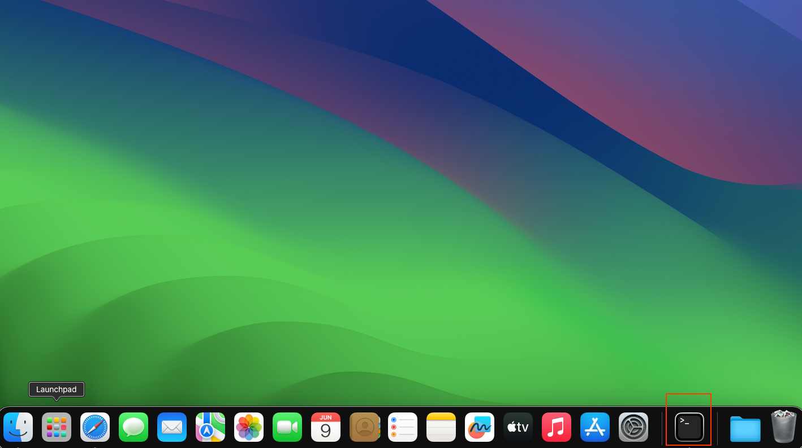
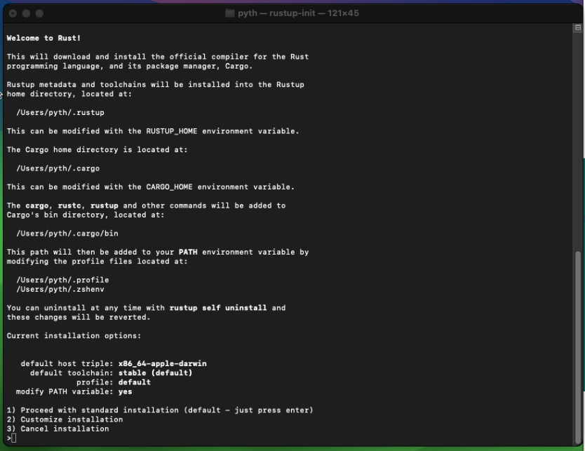
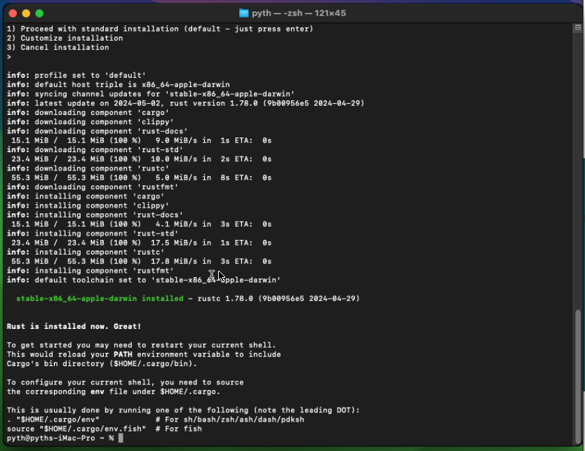
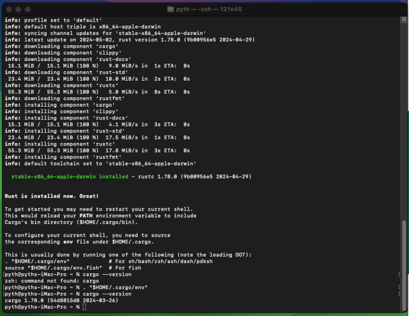
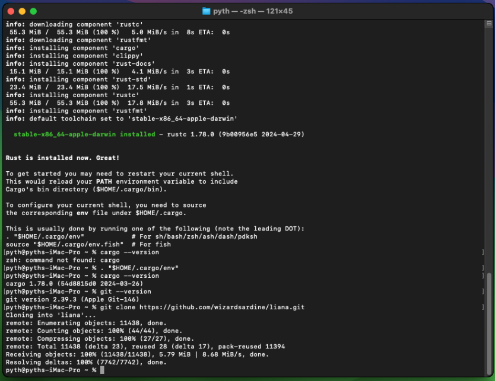
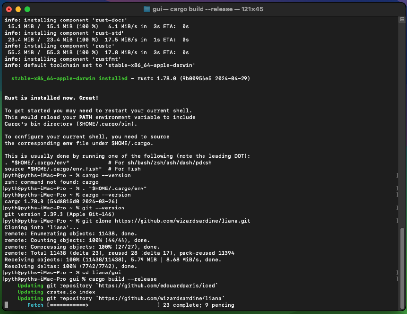
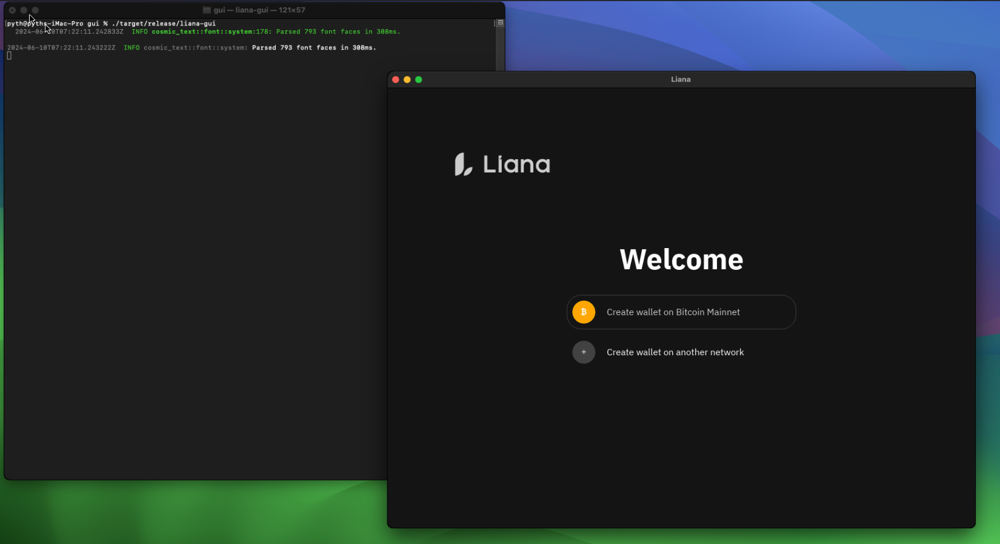

# Build Liana from sources on MacOS

## Rust toolchain

If  you visit [rust website](https://www.rust-lang.org/tools/install) you will find
the commands for install rust on your system:



You should open a terminal:



Copy the command into the terminal and hit enter:



Select `1) Proceed with standard installation` or press enter



Rust is now installed you can enter this command and check cargo is well installed:

```shell
. "$HOME/.cargo/env"
```

then

```shell 
cargo --version
```



## Liana source code

Download my liana repository :
Note: this is not the 'official' [Liana](https://github.com/wizardsardine/liana) repository but my 
own 'fork' tha i've modified for workshop purpose.

```shell 
git clone https://github.com/pythcoiner/liana.git
```

Note: if `git` is not yet installed on your system, you'll be prompted to accept to install it, 
then you should re-run the command for clone the Liana repository.



Then cd into the liana repository & chechout to `liana_demo` branch:

```shell 
cd liana/gui && git fetch origin liana_demo && git checkout liana_demo
```
and build Liana:



```shell
cargo build --release
```

if the prompt ends up with this you are good:


you can now run liana w/ this command:

```shell
./target/release/liana-gui
```



