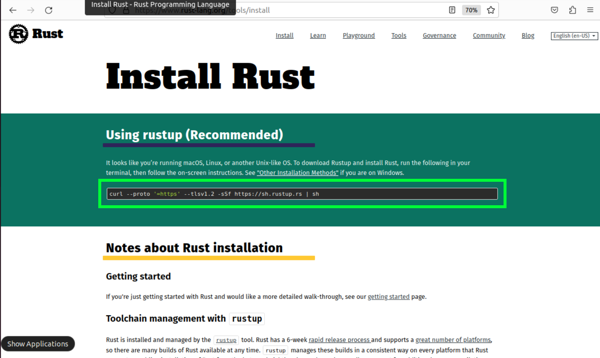
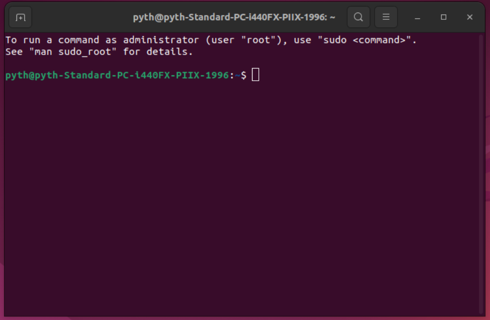
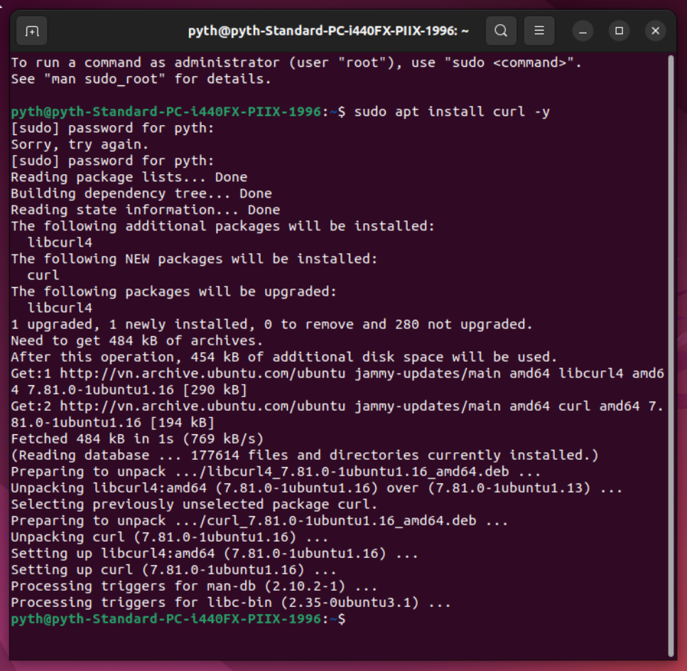
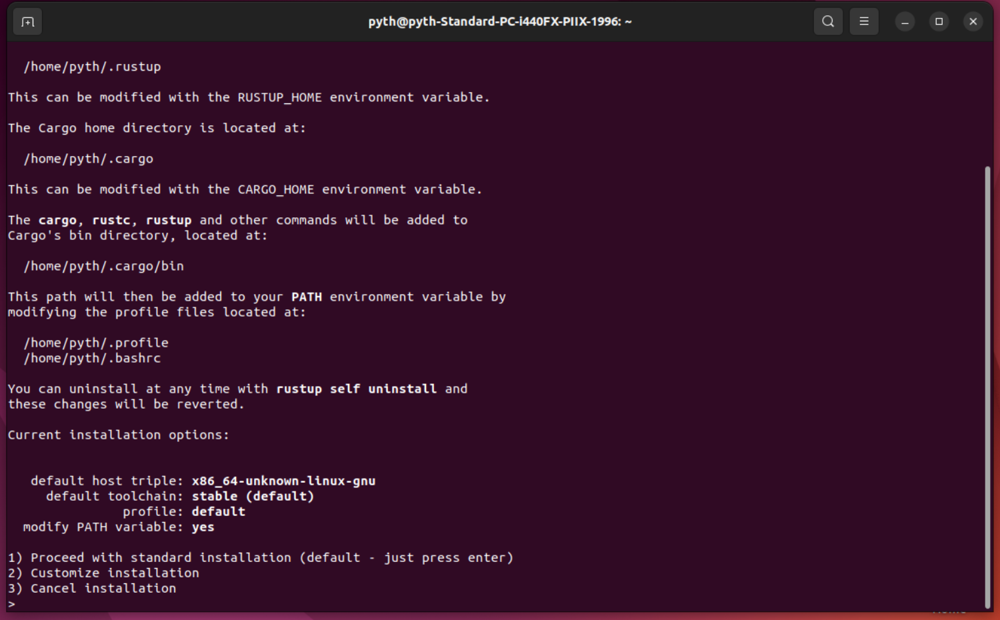
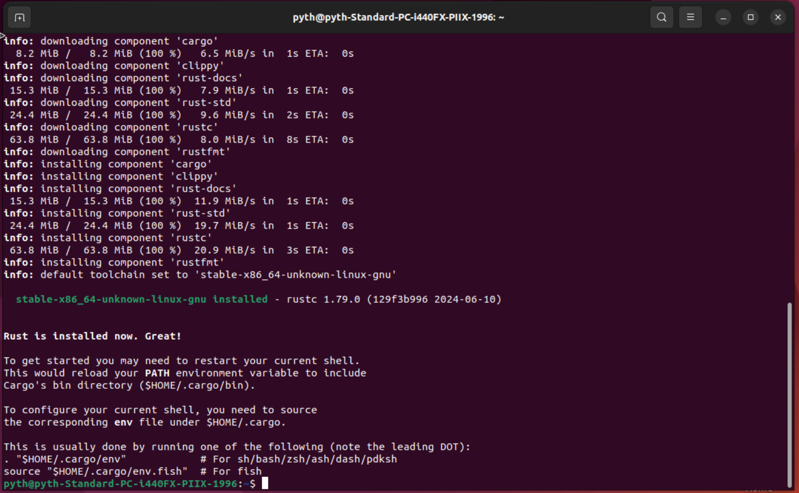
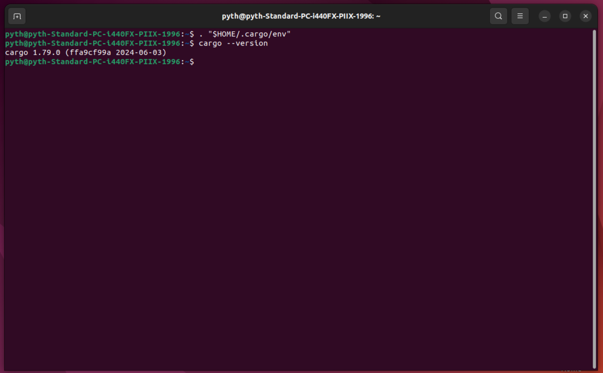
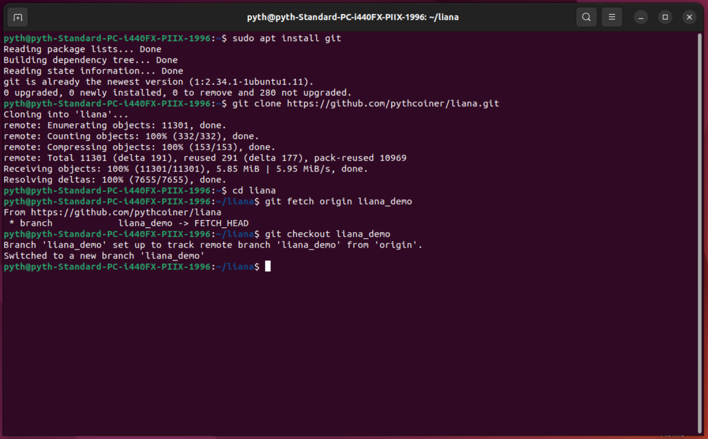
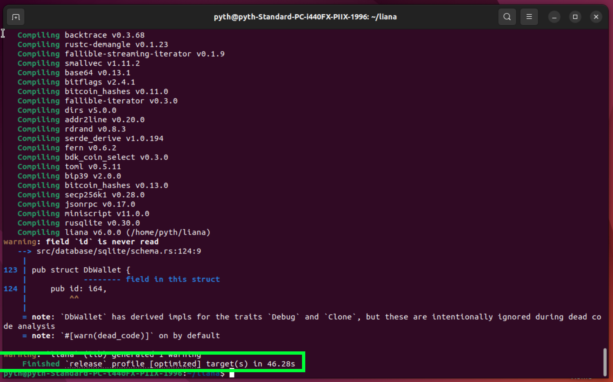
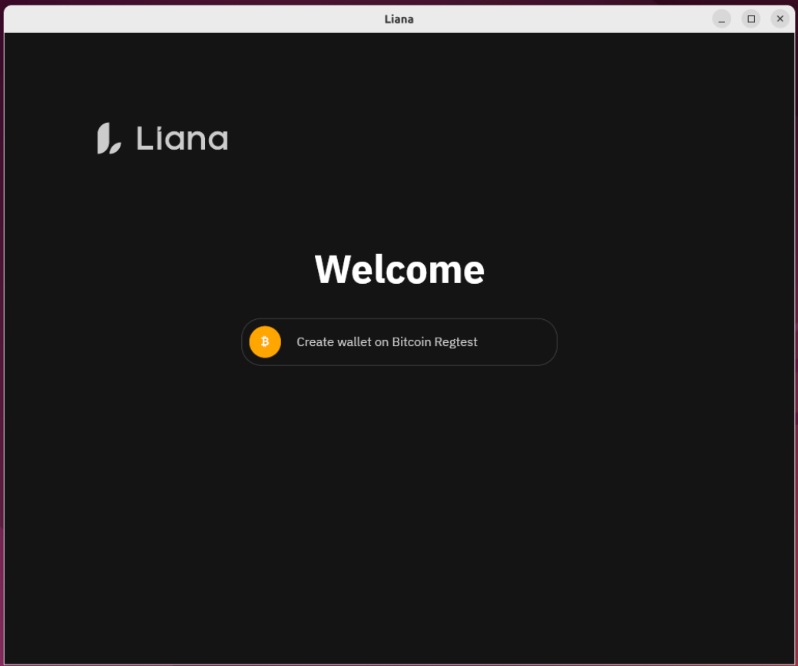

# Build Liana from sources on MacOS

## Rust toolchain

If  you visit [rust website](https://www.rust-lang.org/tools/install) you will find
the commands for install rust on your system:



You should open a terminal:



Install `curl` with this command:

```shell
sudo apt install curl -y
```



Copy the command from rust website into the terminal and hit enter:



Select `1) Proceed with standard installation` or press enter



Rust is now installed you can enter this command and check cargo is well installed:

```shell
. "$HOME/.cargo/env"
```

then

```shell 
cargo --version
```



## Liana source code

First install git:

```shell
sudo apt install git -y
```

Download my liana repository :
Note: this is not the 'official' [Liana](https://github.com/wizardsardine/liana) repository but my 
own 'fork' tha i've modified for workshop purpose.

```shell 
git clone https://github.com/pythcoiner/liana.git
```
then cd into the liana folder:

```shell
cd liana
```
then fetch & checkout to the `liana_demo branch`:

```shell
git fetch origin liana_demo
git checkout liana_demo
```



You can now install Liana dependencies:

```shell
sudo apt install libfontconfig11-dev libudev-dev pkg-config build-essential -y
```

and build Liana-gui:


```shell
cd gui && cargo build --release
```

if the prompt ends up with this you are good:



you can now run liana w/ this command:

```shell
./target/release/liana-gui
```



