# Build Liana from sources on Windows 10

## Rust toolchain

If  you visit [rust website](https://www.rust-lang.org/tools/install) you will find
the method for install rust on your system:

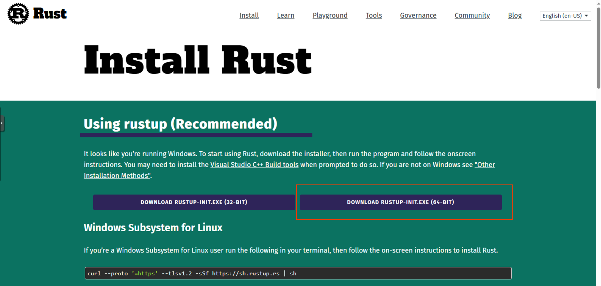

Download rust installer for your platform, its likely 64-bits one.

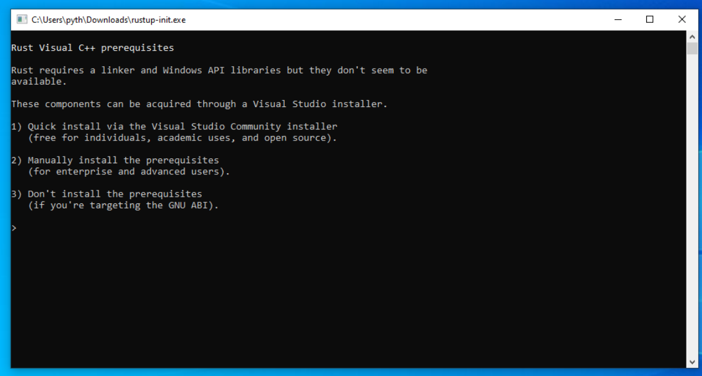

Execute it and choose the first option.

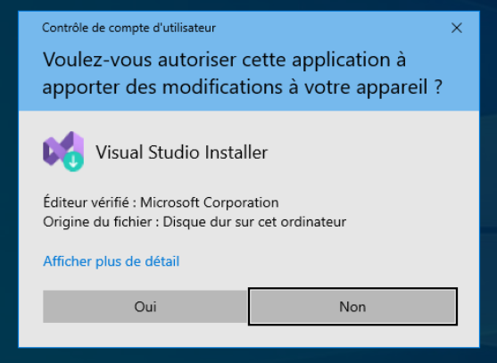

You'll be asked to install visual studio installer, do it and follow its install process.

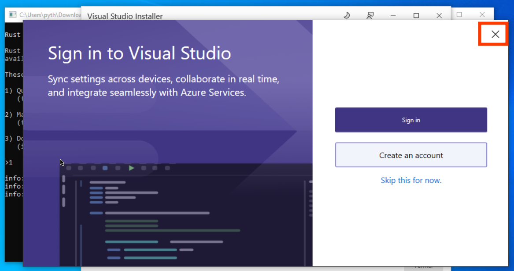

At this step, close visual studio.

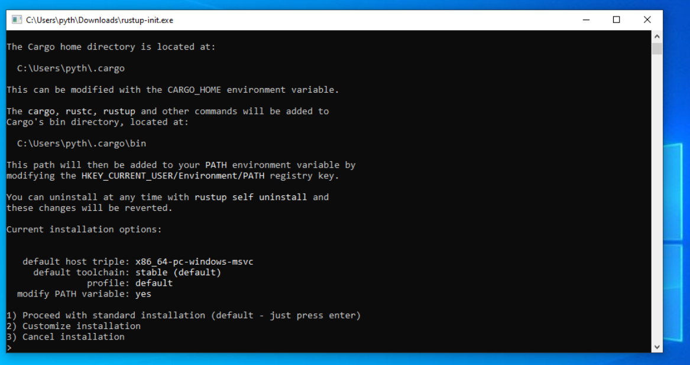

Choose the first option.

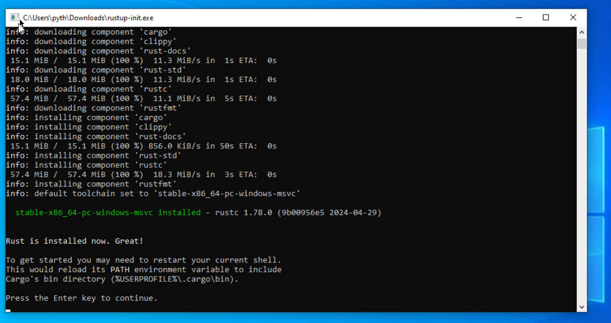

At this step in enter to close terminal.

## Install Git

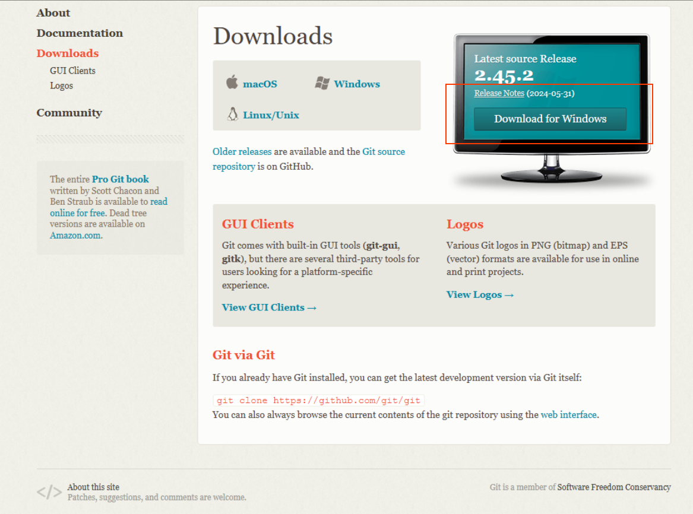

Go to [git website](https://git-scm.con/download) in order to download its installer.

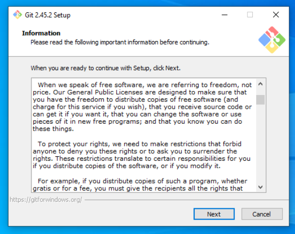

Then start installer.

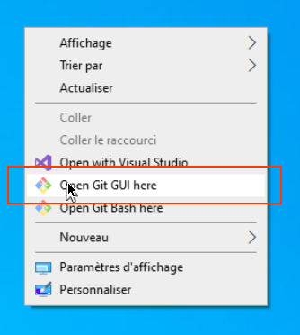

and follow the installer step w/ defaults options.

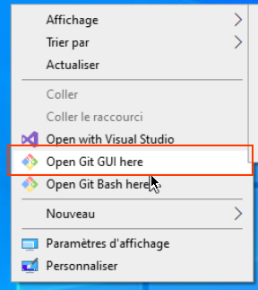

right click + open git gui

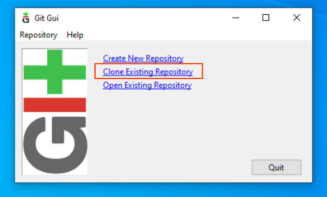

select "Clone Existing Repository"

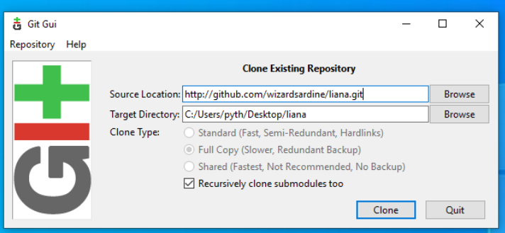

Enter my liana repository address (https://github.com/pythcoiner/liana.git) and your target directory
Note: this is not the 'official' [Liana](https://github.com/wizardsardine/liana) repository but my 
own 'fork' tha i've modified for workshop purpose.

then click `Clone`.

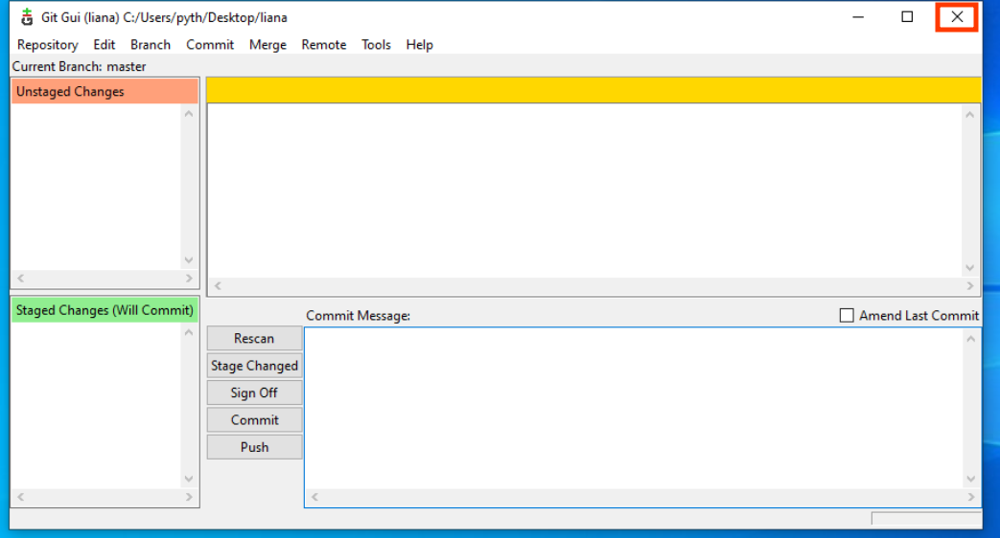

After download has finnish close Git Gui

open liana/gui folder

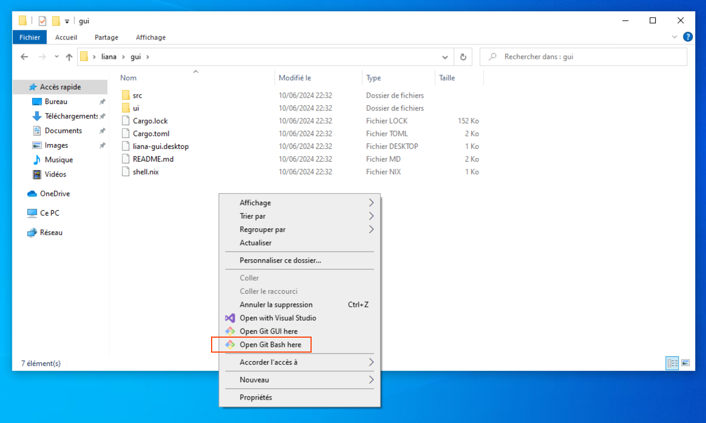

right click + open Git Bash

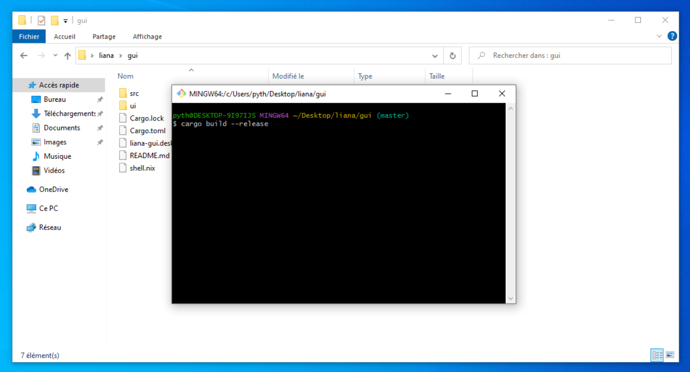

Type `git fetch origin liana_demo && git checkout liana_demo && cargo build --release` and hit enter.

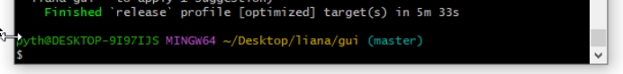

If you get this at the end of the build you are good, and can close the terminal!

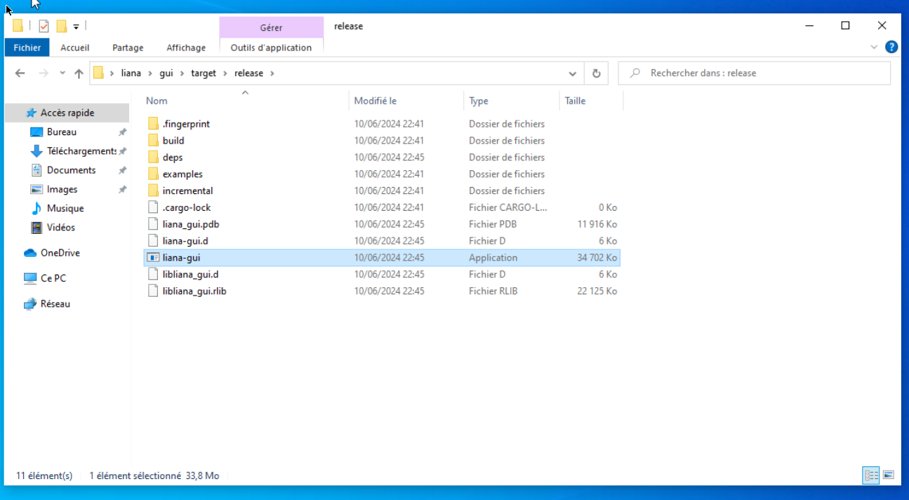

Then go to target/release directory and execute liana-gui

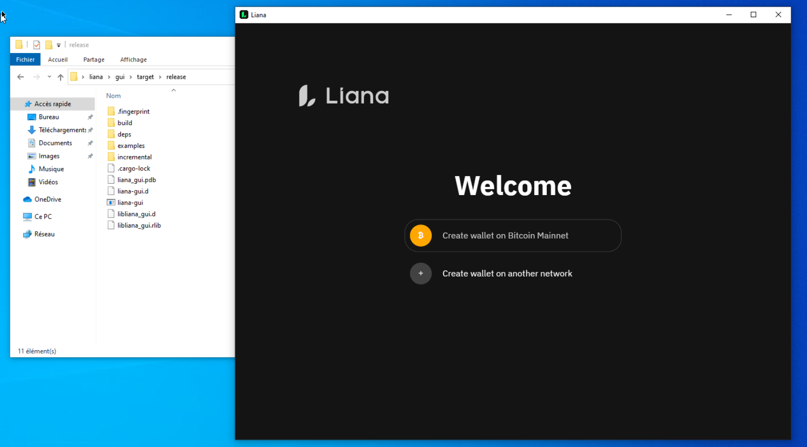

